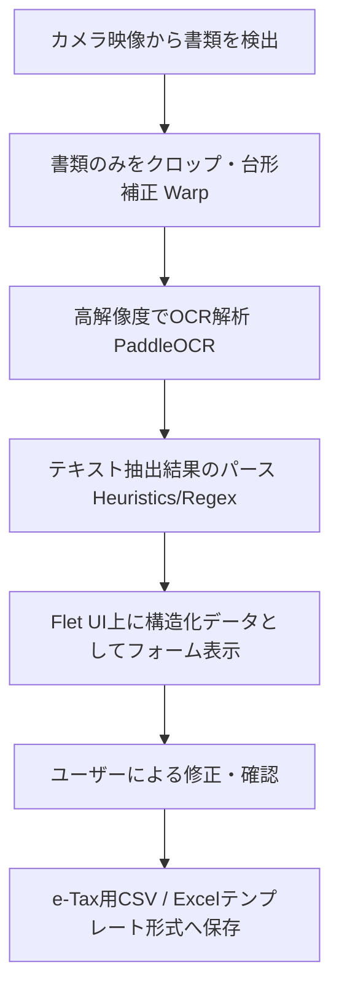

# 医療費控除の画像入力機能の設計・実装計画

本計画では、カメラで読み取った医療機関や薬局の領収書画像から、確定申告（医療費控除）に必要な項目を自動抽出し、データ化する機能の実装について提案します。

---

## 医療費控除に必要なデータ項目 (e-Tax形式)
日本の確定申告における「医療費控除の明細書」では、以下の情報の入力が必要です：
1. **医療を受けた人の氏名**（患者名）
2. **病院・薬局などの支払先の名称**（医療機関名・薬局名）
3. **医療費の区分**（以下のいずれか）
   - 診療・治療
   - 医薬品購入
   - 介護保険サービス
   - 送迎費等
4. **支払った医療費の額**（自己負担額）
5. **補填された金額**（生命保険や高額療養費などで補填された額）

---

## 提案するシステムフロー

### 1. 前処理とドキュメント切り出し（Warp/Crop）の追加
現在の `main.py` はカメラのフレーム全体のOCRを行っていますが、領収書は斜めに映ることが多く、枠外のノイズも入ります。
- 輪郭検出された4つの頂点座標を利用し、`cv2.getPerspectiveTransform` と `cv2.warpPerspective` を用いて、領収書部分だけを正面から撮影したように平坦化・クロップする処理を追加します。これによりOCR認識率が飛躍的に向上します。

### 2. 医療費領収書向けパースロジック（正規表現・キーワードマッチ）
抽出されたテキスト行から、以下のルールに基づき情報を判定します：
* **支払額の抽出**:
  - `合計` `お支払額` `一部負担金` `請求額` `領収金額` などのキーワードの近くにある金額数値（例: `\d{1,3}(,\d{3})*円` または単なる数値）を判定。
* **支払先の抽出**:
  - 行末が `クリニック` `医院` `病院` `薬局` `内科` `皮膚科` `歯科` などで終わる、または領収書の「発行者」表記エリアを抽出。
* **患者名の抽出**:
  - `様` `殿` `患者名` のプレフィックス・サフィックスが付いた氏名を抽出。
* **区分の推測**:
  - 支払先に `薬局` が含まれる場合は「医薬品購入」、それ以外は基本的に「診療・治療」とデフォルト設定。

### 3. UIの拡張
画面右側の設定パネルの下部、または別タブとして「医療費控除入力フォーム」を追加します。
- **入力フィールド**: 「対象者名」「支払先名称」「支払額」「補填額」「区分選択（ドロップダウン）」
- **結果連携**: OCRが完了した時点で、これらフィールドに自動入力されます。ユーザーは手動で修正できます。
- **保存ボタン**: 入力内容をローカルのCSVファイル（e-Taxの読込フォーマットに準拠）に追記します。

---

## 変更予定ファイル

### `main.py`
* **画像ワープ関数の追加**: 4角の輪郭点からアスペクト比を計算し、正面画像に変換する `warp_document` 関数を追加します。
* **OCR結果パースモジュールの追加**: パース用のヘルパー関数/クラスを追加します。
* **Flet UIのレイアウト更新**:
  - 読み取り結果を編集・確認できる入力フォームコントロール群を追加。
  - CSVエクスポート用のボタンと設定を追加。

---

## オープンクエスチョン (検討事項)

1. **データの出力先（保存方法）について**
   - e-Taxでそのままインポートできる **「医療費控除の明細書（CSV形式）」** で出力するのが最も実用的ですが、これで進めてよろしいでしょうか？（または単純な一覧用のCSVで十分でしょうか）
2. **AI/LLMによる抽出の併用について**
   - コストをかけずオフラインで完結させるため、まずはルールベース（正規表現）で実装する予定です。
3. **患者名（対象者名）のデフォルト設定について**
   - 家族構成が決まっている場合、UI側にあらかじめ家族の名前を登録しておき、ドロップダウンから選べるようにすると利便性が高まります。
